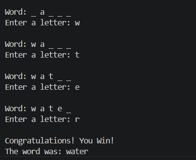

# 🎮 Hangman Game

## 🌟 CodeAlpha Python Programming Internship – Task 1

### 📌 Project Overview

This project is a simple text-based Hangman Game developed using Python. The player guesses a hidden word one letter at a time. The game continues until the player successfully guesses the word or runs out of chances.

### 🎯 Objective

To build an interactive word guessing game and understand core Python programming concepts.

### 🛠 Tools & Technologies

* Python 🐍
* VS Code

### ✨ Features

✅ Random word selection

✅ Letter-by-letter guessing

✅ 6 incorrect guesses allowed

✅ Win and Lose conditions

✅ Console-based gameplay

### 📚 Concepts Used

* Random Module
* Lists
* Strings
* While Loop
* Conditional Statements
* User Input

### ▶️ How to Run

```bash
python hangman.py
```

### 📸 Output

## 📸 Output



### 🎯 Conclusion

This project helped me strengthen my understanding of Python fundamentals by implementing a fun and interactive Hangman Game.

---

## 👩‍💻 Author

**Chinta Ramalakshmi**

Python Programming Intern @ CodeAlpha
